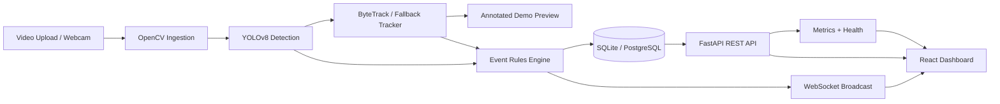

# Architecture

## Data Flow

1. A user uploads video from the dashboard or connects a camera stream.
2. FastAPI stores the upload and queues a background processing job.
3. OpenCV reads frames and YOLOv8 detects people.
4. The tracker assigns stable IDs and feeds zone and dwell-time heuristics.
5. Events and analytics snapshots are written to the database.
6. WebSocket messages stream live status, alerts, and analytics back to the dashboard.
7. The dashboard updates cards, alerts, timeline entries, and camera status in real time.

## Event Pipeline

- Overcrowding: people count exceeds the configured threshold.
- Suspicious lingering: a tracked person remains in a zone for too long.
- Restricted zone entry: a track enters a restricted area.
- Unusual movement: a track follows an anomalous path or motion pattern.
- High density: occupancy density rises above the configured level.

## Real-Time Processing Flow

The backend sends `job_status` updates while a video is being processed, then emits `analytics` and `alert` messages whenever the pipeline detects a meaningful change. The frontend keeps the UI responsive by showing loading states, toasts, and live panel refreshes instead of waiting for a full page reload.

## Deployment Architecture

- Local development uses SQLite and direct backend/frontend startup.
- Docker Compose runs FastAPI, the React app, and PostgreSQL on one shared network.
- The startup scripts provide a one-command entry point for Docker or local development.
- The backend auto-initializes the database schema and seeds demo data when `DEMO_MODE=true`.

## Trade-offs

The MVP favors deterministic engineering over model training. It uses a pretrained detector and a rule-based event layer so the system can be deployed quickly and inspected easily. The tracker abstraction can later be swapped for a stronger ByteTrack or DeepSORT integration without changing the API contract.

## Scalability

- The ingestion pipeline is isolated from the API layer.
- Background processing can move to a worker queue such as Celery or RQ.
- PostgreSQL can replace SQLite without changing the ORM models.
- WebSocket fanout can move behind Redis pub/sub for multi-instance deployments.